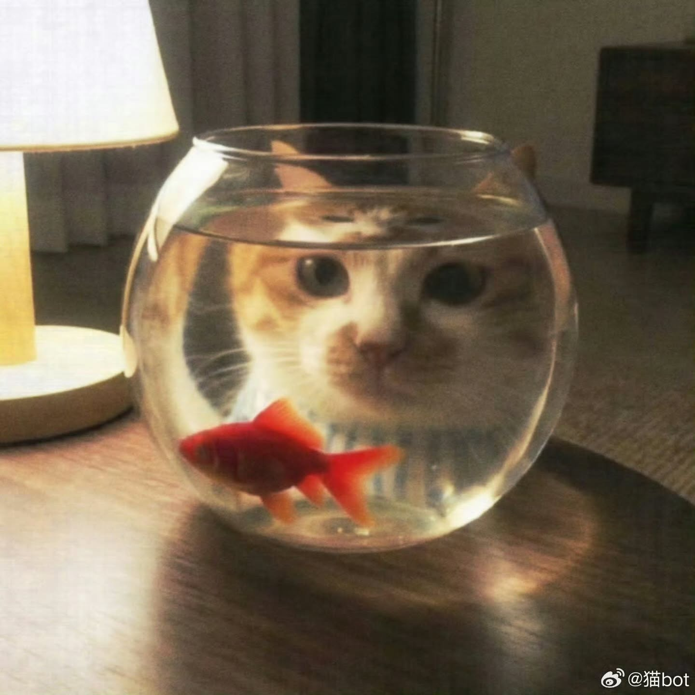
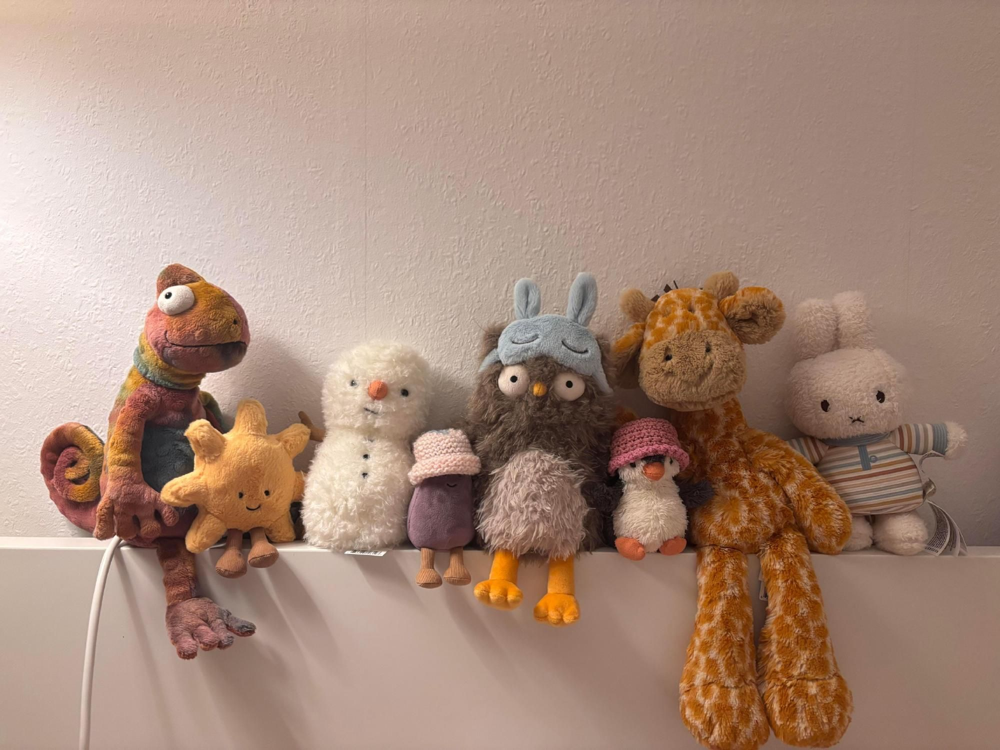
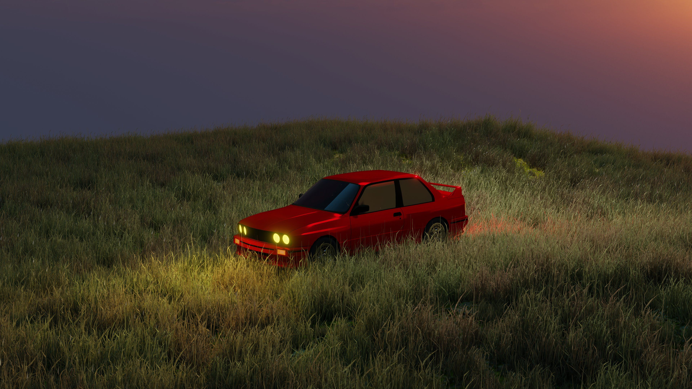
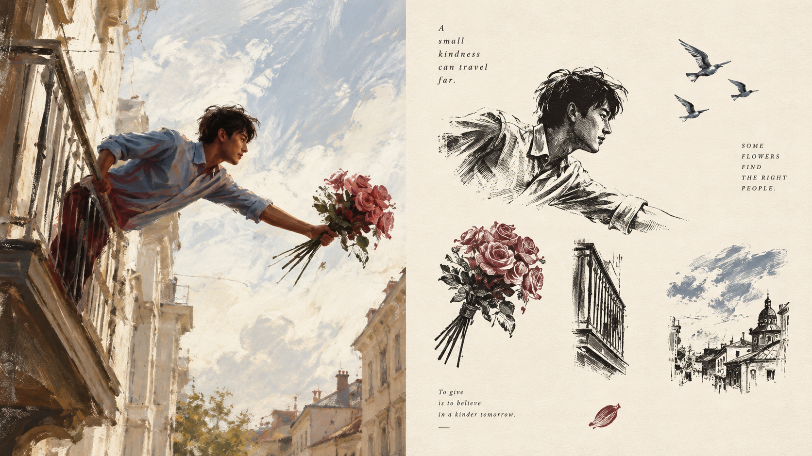

<div align="center">

# XXD Panel 223｜摄影与数码混合媒介拼贴海报

Redirect an everyday photograph into a standalone art poster, preserving its recognisable core while rethinking material, composition and whitespace.

<a href="README.md">简体中文</a> · <a href="README.en.md">English</a> · <a href="README.ja.md">日本語</a> · <a href="README.ko.md">한국어</a> · <a href="README.ar.md">العربية</a>

</div>

## Sample works

本项目已发布 8 张实际样片，图片文件位于 `assets/examples/`。

| sample-01 | sample-03 | sample-05 | sample-07 |
| --- | --- | --- | --- |
|  |  |
| sample-03 | sample-04 |
|  |  |
| sample-05 | sample-06 |
|  |  |
| sample-07 | sample-08 |
|  |  |

## Best-fit situations and problems solved

For personal photography collections, independent publications, exhibition studies and lifestyle visuals. A weak composition, busy background or small subject becomes a starting point for subtraction, rearrangement, cropping and scale changes—not a reason to apply a filter.

上半部分保留原始照片，保持主体身份、结构、姿态、真实质感、自然光影和原有色彩氛围，仅进行轻微高级调色

## Original prompt

The [complete Chinese source](references/original-prompt/zh-CN.md) is preserved verbatim and is the sole creative and aesthetic authority at runtime. This batch provides five-language usage documentation, without four additional long-form translations. Style summaries are for discovery only and never replace the source.

## Quick fit check

Keep the source identity while redirecting composition; retain the material signature while actively leaving space. Choose exact text, generated copy or no text, with single-image or recursive directory processing and the four delivery modes below.

## Transformation logic

Read the subject and relationships → extract the original brief’s visual language → remove irrelevant detail → recompose scale, placement and whitespace → add minimal source-grounded copy → check geometry, text and finish

## Recognisable finished traits

上半部分保留原始照片，保持主体身份、结构、姿态、真实质感、自然光影和原有色彩氛围，仅进行轻微高级调色

## Four output modes

- `top-bottom`: exactly two full-width regions, reality above and design below, 50% each.
- `left-right`: exactly two full-height regions, reality left and design right, 50% each; it never rotates into a top-bottom layout.
- `design-only`: the full canvas contains only Panel 223's designed translation; the photograph remains a non-visible reference.
- `wallpaper-pack`: creates complete artworks for phone, iPad, desktop, and watch, either `linked` as a coherent family or `independent` as four separate works.

Modes and sizes may be combined. Supported sizes include `1:1`, `3:4`, `4:3`, `4:5`, `5:4`, `2:3`, `3:2`, `9:16`, `16:9`, `21:9`, `5:7`, `7:5`, and exact pixels. Text can be prompt-generated, user-exact, or absent. A directory is inventoried recursively and every source is isolated while sharing one set of delivery settings; final PNG files remain flat in one fresh task directory.

## Getting started

Install from GitHub:

```bash
npx skills add https://github.com/nevertoday/xxd-panel-223 --skill xxd-panel-223
```

Restart the agent session after installation, then invoke `$xxd-panel-223`. Add `--global --agent codex --yes` when a user-level Codex installation is wanted.

Common examples:

```text
/xxd-panel-223 photo.jpg --mode top-bottom --size 3:4 --text prompt --locale en-US
/xxd-panel-223 photo.jpg --mode left-right --size 16:9 --text prompt --locale en-US
/xxd-panel-223 photo.jpg --mode design-only --size 9:16 --text none --prefs off
/xxd-panel-223 ./photos --mode design-only --size auto,3:4 --text prompt --locale ja-JP
```

See [SKILL.md](SKILL.md) for the full runtime contract and the [English](references/xxd-panel-223-prompt.en.md) or [Chinese](references/xxd-panel-223-prompt.zh-CN.md) runtime adapter.

<!-- xxd-readme-ads:start -->
## About XXD

XXD is Xiaoxiaodong's abbreviated brand name. Created and maintained by [@xiaoxiaodong01](https://x.com/xiaoxiaodong01).

## Support and membership

> **Advertising disclosure:** QR codes and paid membership/service links in this section are XXD promotional content. Scanning or purchasing is optional and does not affect access to this open-source project.


<!-- xxd-panel-command-system:start -->

All General Skills are included in the CNY 699/year membership; no separate purchase is required.

| Level | Skill | Responsibility |
|---|---|---|
| **General** | [`xxd-panel-all`](https://github.com/xiaoxiaodong-ai/xxd-panel-all) | Detect available numbered Skills; recommend by image, theme, or use; dispatch a chosen number; organize multi-style trials; and assign folders of images to individual jobs. |
| **Soldiers** | `xxd-panel-NNN` | Each numbered Skill executes only its own original brief and aesthetic, completing the individual job assigned by the General. |

<!-- xxd-panel-command-system:end -->

### Knowledge Planet + Member Prompt Library + All General Skills Membership · CNY 699/year

[Knowledge Planet](https://wx.zsxq.com/group/15554814142882), the [XXD Member Prompt Library](https://vip.xiaoxiaodong.ai/), and membership for all General Skills are one membership: **one annual payment unlocks all three benefits, with no second purchase required.**

[Knowledge Planet](https://wx.zsxq.com/group/15554814142882) · [Member Prompt Library](https://vip.xiaoxiaodong.ai/)

<p align="center"><a href="https://xiaoxiaodong.pages.dev/assets/wechat-qr.png"></a></p>
<!-- xxd-readme-ads:end -->

## License

This project—including the Skill, prompts, scripts, documentation, and accompanying sample images—is licensed under the **PolyForm Noncommercial License 1.0.0**. See [LICENSE](LICENSE) for the full legal text and <https://polyformproject.org/licenses/noncommercial/1.0.0> for the official page.

In plain language:

- Individuals may use it for study, research, experimentation, testing, hobby projects, and private entertainment. Charities, educational institutions, public research, safety or health organisations, environmental organisations, and government institutions may also use it.
- For **noncommercial purposes**, you may use, copy, modify, create derivative works, and share it. When sharing, you must also provide this license (or the link above) and every `Required Notice:` statement supplied by the author.
- It may not be used in commercial products or services, paid delivery, sale of access or licences, or any use expected to lead to commercial application. Obtain separate written permission from the copyright holder before commercial use.
- The agreement grants only the copyright licence and limited patent licence expressly stated. It grants no trademarks, brand names, or other unstated rights, and you may not sublicense your licence to others.
- After written notice of a violation, you must return to compliance and take practical remedial steps within 32 days, or the licences terminate immediately. A written patent-infringement claim also terminates the patent licence.
- The material is provided “as is”, without warranty to the extent permitted by law. Users bear the risks and potential losses arising from its use.
